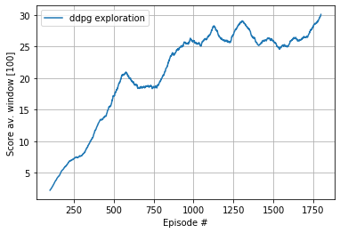

[//]: # (Image References)

[image1]: https://user-images.githubusercontent.com/10624937/42135619-d90f2f28-7d12-11e8-8823-82b970a54d7e.gif "Trained Agent"

## Project 2: Continuous Control with DDPG

Note. As it shares and evolves components (classes and factories) used from the project 1. It was natural to keep both the DQN (banana collector) and the continuous control cohabiting in this repo. 

### Env. description

For this project, an agent is trained to solve the `Reacher` env, where a double-jointed arm can move to target (sphere) locations.
A reward of +0.1 is provided for each step that the agent's hand is in the goal location. Thus, the goal of our agent is to maintain its position at the target location 
for as many time steps as possible. 

The observation space consists of 33 variables corresponding to position, rotation, velocity, and angular velocities of the arm.
Each action is a vector with four numbers, corresponding to torque applicable to two joints. Every entry in the action vector should be a number between -1 and 1.

In order to solve the environment agent must get an average score of +30 over 100 consecutive episodes.

### Env. setup (Getting Started)

For this project,  you need only select the environment that matches your operating system:

Version 1: One (1) Agent

   - Mac: [click here](https://s3-us-west-1.amazonaws.com/udacity-drlnd/P2/Reacher/one_agent/Reacher.app.zip)
   - Linux (x86_64): [click here](https://s3-us-west-1.amazonaws.com/udacity-drlnd/P2/Reacher/one_agent/Reacher_Linux.zip)

### Implemented Solution
 
To solve the `Reacher problem` a configurable `DDPG` with injectable Actor and Critic network architecture is implemented.
A detailed session of training is reported in  `Report_ddpg.ipynb` python notebook. 

### The agent evolving

Because it was fun watching the agent learning and struggling through the env. A capture is reported here while the agent is performing 
well towards the solved state solution. This behavior is captured  an average  score of 26 over the last 100 episodes. 

The average last 100 episodes score evolved as shown in the next plot.

### Future extension 

As extension explore the `A3C` algorithm to leverage the `20-agents Reacher env` and explore the `DDPG` implementation for the `Crawler` env.
    

# Project 1: Navigation

### DQN Based agent

For this project, a simple DQN based agent is trained to navigate (and collect bananas!) in a large, square world.  

The python notebook `Navigation.ipynb` demo agent capabilities (while varying some params.): the agent solved the env in sensibly less than 500 episodes. The notebook
uses agent implemented in `dqn_agent.py` which is an adapted version of https://github.com/udacity/deep-reinforcement-learning/tree/master/dqn to the Banana collector env.

### Env. description
 
![Trained Agent][image1]

A reward of +1 is provided for collecting a yellow banana, and a reward of -1 is provided for collecting a blue banana.  Thus, the goal of your agent is to collect as many yellow bananas as possible while avoiding blue bananas.  

The state space has 37 dimensions and contains the agent's velocity, along with ray-based perception of objects around agent's forward direction.  Given this information, the agent has to learn how to best select actions.  Four discrete actions are available, corresponding to:
- **`0`** - move forward.
- **`1`** - move backward.
- **`2`** - turn left.
- **`3`** - turn right.

The task is episodic, and in order to solve the environment, the agent must get an average score of +13 over 100 consecutive episodes.

### Getting Started

1. Download the environment from one of the links below.  You need only select the environment that matches your operating system:
    - Linux: [click here](https://s3-us-west-1.amazonaws.com/udacity-drlnd/P1/Banana/Banana_Linux.zip)
    - Mac OSX: [click here](https://s3-us-west-1.amazonaws.com/udacity-drlnd/P1/Banana/Banana.app.zip)
    - Windows (32-bit): [click here](https://s3-us-west-1.amazonaws.com/udacity-drlnd/P1/Banana/Banana_Windows_x86.zip)
    - Windows (64-bit): [click here](https://s3-us-west-1.amazonaws.com/udacity-drlnd/P1/Banana/Banana_Windows_x86_64.zip)
    
    (_For Windows users_) Check out [this link](https://support.microsoft.com/en-us/help/827218/how-to-determine-whether-a-computer-is-running-a-32-bit-version-or-64) if you need help with determining if your computer is running a 32-bit version or 64-bit version of the Windows operating system.

    (_For AWS_) If you'd like to train the agent on AWS (and have not [enabled a virtual screen](https://github.com/Unity-Technologies/ml-agents/blob/master/docs/Training-on-Amazon-Web-Service.md)), then please use [this link](https://s3-us-west-1.amazonaws.com/udacity-drlnd/P1/Banana/Banana_Linux_NoVis.zip) to obtain the environment.

2. Place the file in the `drlnd_p1_navigation/` folder, and unzip (or decompress) the file. 

### (To be added ) Challenge: Learning from Pixels

